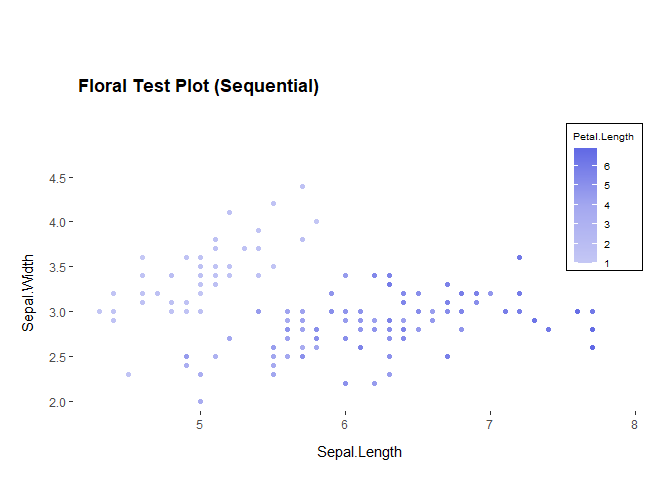
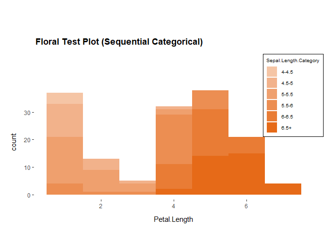

<!-- README.md is generated from README.Rmd. Please edit that file -->

# guttmacherggplottheme

<!-- badges: start -->
<!-- badges: end -->

The goal of guttmacherggplottheme is to provide ggplot themes and color
palettes that align with Guttmacher’s branding.

## Installation

You can install the development version of guttmacherggplottheme from
[GitHub](https://github.com/) with:

``` r
# install.packages("devtools")
devtools::install_github("GuttInst/guttmacherggplottheme")
```

## Example

This is a basic example which shows you how to solve a common problem:

``` r
library(guttmacherggplottheme)
library(ggplot2)
#> Warning: package 'ggplot2' was built under R version 4.2.3
library(ggthemes)
#> Warning: package 'ggthemes' was built under R version 4.2.3
library(extrafont)
#> Registering fonts with R

data(iris)

font_import(pattern="arial.ttf", prompt=FALSE)
#> Scanning ttf files in C:\windows/Fonts, C:\Users\amurulidhar\AppData\Local/Microsoft/Windows/Fonts ...
#> Extracting .afm files from .ttf files...
#> C:\Windows\Fonts\arial.ttf : ArialMT already registered in fonts database. Skipping.
#> Found FontName for 0 fonts.
#> Scanning afm files in C:/Users/amurulidhar/AppData/Local/R/win-library/4.2/extrafontdb/metrics
loadfonts()
#> Arial already registered with windowsFonts().
#> Arial already registered with pdfFont().
#> Arial already registered with postscriptFont().

# Define color palettes
categorical_palette <- guttmacherggplottheme::get_categorical_palette(4)
sequential_palette <- guttmacherggplottheme::get_sequential_palette("violet")
divergent_palette <- guttmacherggplottheme::get_divergent_palette() 

# Test plot with categorical palette
ggplot2::ggplot(iris, aes(x = Sepal.Length, y = Sepal.Width, color = Species)) +
  geom_point() + labs (title ="Floral Test Plot (Categorical)" )  + 
  scale_color_manual(values = categorical_palette) + # Use categorial palette here
  guttmacherggplottheme::guttmacher_theme()
```


``` r

# Test plot with sequential palette
ggplot(iris, aes(x = Sepal.Length, y = Sepal.Width, color = Petal.Length)) +
  geom_point() + scale_color_gradientn(colors = sequential_palette) + # Use sequential palette here
  guttmacherggplottheme::guttmacher_theme() +
  labs(title = "Floral Test Plot (Sequential)") 
```



``` r

# Test plot with divergent palette 
divergent_palette <- guttmacherggplottheme::get_divergent_palette() 
ggplot(iris, aes(x = Sepal.Length, y = Sepal.Width, color = Petal.Length)) +
  geom_point() + scale_color_gradientn(colors = divergent_palette) + # Use divergent palette here
  guttmacherggplottheme::guttmacher_theme() +
  labs(title = "Floral Test Plot (Divergent)") 
```


