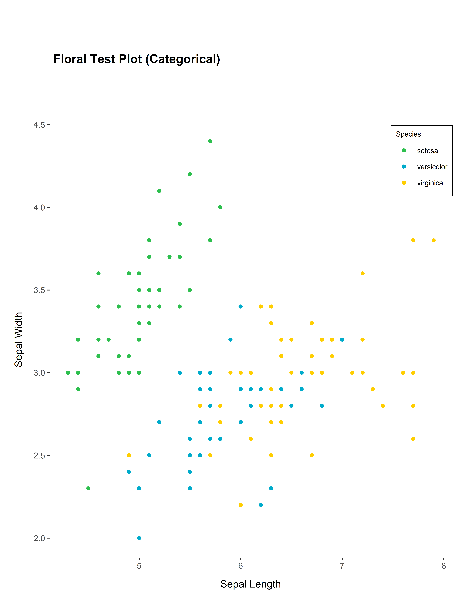
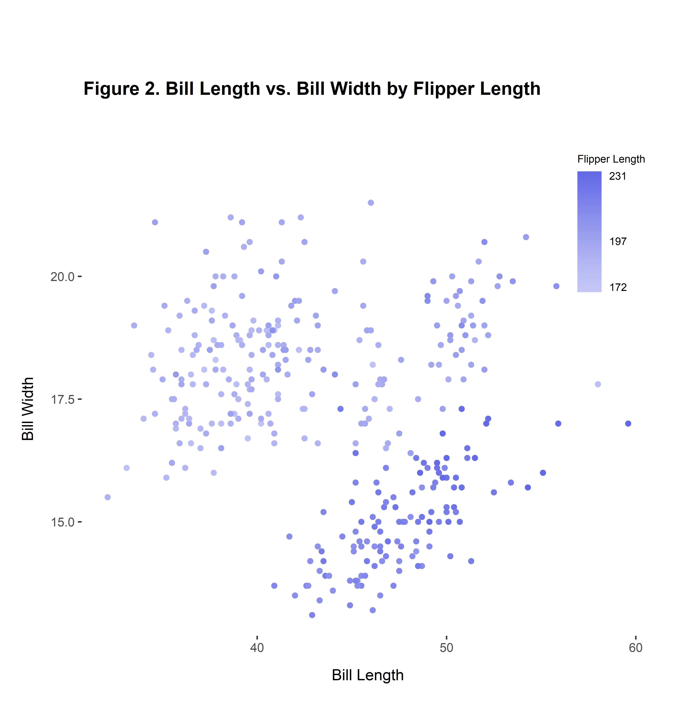
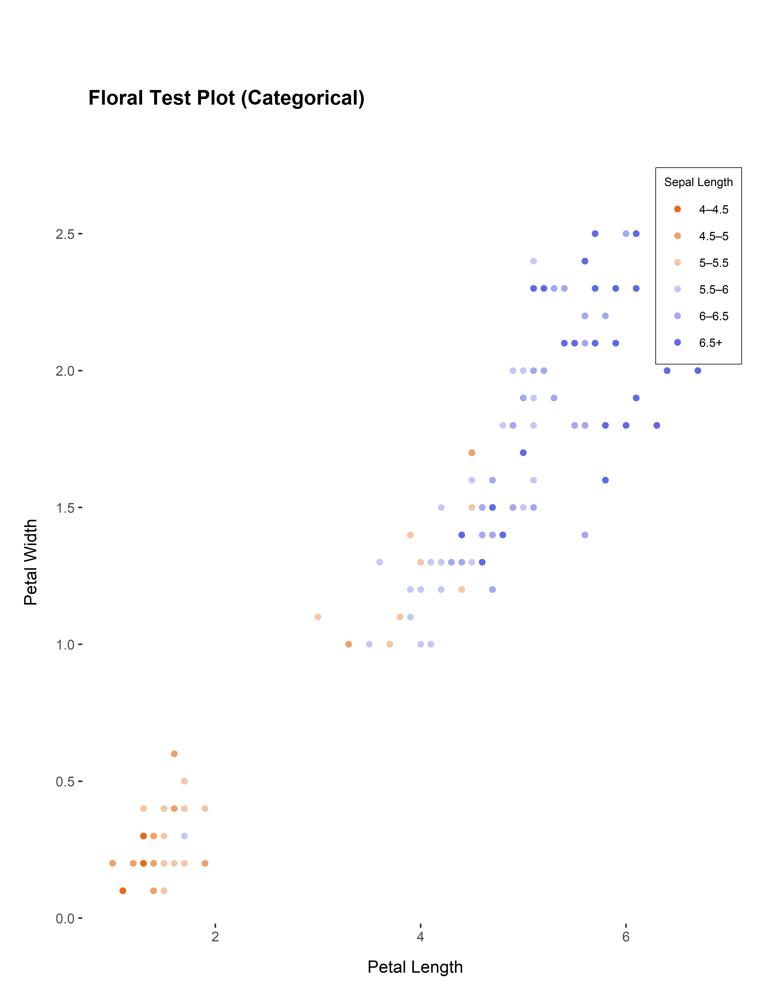

<!-- README.md is generated from README.Rmd. Please edit that file -->

# guttmacherggplottheme

<!-- badges: start -->
<!-- badges: end -->

The goal of guttmacherggplottheme is to provide ggplot themes and color
palettes that align with Guttmacher’s branding.

Please note that get_divergent_categorical_palette() is only intended
for plots with exactly 6 categorical variables.

## Installation

You can install the guttmacherggplottheme from
[GitHub](https://github.com/) with:

``` r
# install.packages("devtools")
devtools::install_github("GuttInst/guttmacherggplottheme")
```

## Example

Here’s a simple example that shows you how to make a plot using the
guttmacherggplottheme palettes and theme:

``` r
################################################################################
# First, you'll need to load the necessary libraries and then load the dataset.
# This examples uses the built-in R dataset called "iris." The next step is to
# prep the dataset for use by transforming one of the continuous variables, 
# "Sepal.length" into a categorical variable by binning the values into 
# categories based on discrete intervals.
################################################################################

# Load libraries
library(guttmacherggplottheme)
library(ggplot2)
#> Warning: package 'ggplot2' was built under R version 4.2.3
library(ggthemes)
#> Warning: package 'ggthemes' was built under R version 4.2.3
library(extrafont)
#> Registering fonts with R
library(dplyr)
#> 
#> Attaching package: 'dplyr'
#> The following objects are masked from 'package:stats':
#> 
#>     filter, lag
#> The following objects are masked from 'package:base':
#> 
#>     intersect, setdiff, setequal, union

# Load iris dataset
data(iris)

# Create bins for Sepal.Length variable
iris <- iris %>%
  mutate(Sepal.Length.Category = cut(Sepal.Length,
                                      breaks = c(4, 4.5, 5, 5.5, 6, 6.5, max(iris$Sepal.Length)),
                                      labels = c("4–4.5", "4.5–5", "5–5.5", "5.5–6", "6–6.5", "6.5+"),
                                      right = TRUE))

################################################################################
# Then, to be able to use the Guttmacher brand aligned fonts you need to import 
# the Arial font file. This code ensures that the Guttmacher fonts are available
# for use in your R environment.
################################################################################

# Import and load fonts
font_import(pattern="arial.ttf", prompt=FALSE)
#> Scanning ttf files in C:\windows/Fonts, C:\Users\amurulidhar\AppData\Local/Microsoft/Windows/Fonts ...
#> Extracting .afm files from .ttf files...
#> C:\Windows\Fonts\arial.ttf : ArialMT already registered in fonts database. Skipping.
#> Found FontName for 0 fonts.
#> Scanning afm files in C:/Users/amurulidhar/AppData/Local/R/win-library/4.2/extrafontdb/metrics
loadfonts()
#> Arial already registered with windowsFonts().
#> Arial already registered with pdfFont().
#> Arial already registered with postscriptFont().

################################################################################
# Now that the libraries and fonts are ready, you can create a plot!
# Here's a simple categorical plot that uses the Guttmacher theme and palette.
################################################################################

# Standard categorical palette example
categorical_palette <- guttmacherggplottheme::get_categorical_palette(4)        # Define palette
ggplot2::ggplot(iris, aes(x = Sepal.Length, y = Sepal.Width, color = Species)) +
  geom_point() + scale_color_manual(values = categorical_palette) + # Use palette here
  guttmacherggplottheme::guttmacher_theme() + 
  labs (title ="Floral Test Plot (Categorical)", x = "Sepal Length", y = "Sepal Width")
```



Here are a few more examples of how the palettes and theme can be used:

``` r
################################################################################
# More Examples
################################################################################

# Sequential palette example
sequential_palette <- guttmacherggplottheme::get_sequential_palette("blue")     # Define palette
ggplot(iris, aes(x = Sepal.Length, y = Sepal.Width, color = Petal.Length)) +
  geom_point() + scale_color_gradientn(colors = sequential_palette,             # Use palette here
                                       breaks=c(min(iris$Petal.Length),
                                       max(iris$Petal.Length)), 
                                       labels = c(1,round(max(iris$Petal.Length)))) + 
  guttmacherggplottheme::guttmacher_theme() + guides(color = guide_colorbar(ticks.colour = NA)) +
  labs(title = "Floral Test Plot (Sequential)", x = "Sepal Length", y = "Sepal Width", color="Petal Length")
```


``` r

# Sequential categorical palette example
sequential_categorical_palette <- guttmacherggplottheme::get_sequential_categorical_palette("orange", 6)  # Define palette
ggplot2::ggplot(iris, aes(x = Petal.Length, y = Petal.Width, color = Sepal.Length.Category)) +
  geom_point() + scale_color_manual(values = sequential_categorical_palette) + # Use palette here
  guttmacherggplottheme::guttmacher_theme() + labs (title ="Floral Test Plot (Categorical)", 
                                                    x = "Petal Length", y = "Petal Width", 
                                                    color = "Sepal Length" ) 
```



``` r

# Divergent palette example
divergent_palette <- guttmacherggplottheme::get_divergent_palette()             # Define palette   
ggplot(iris, aes(x = Sepal.Length, y = Sepal.Width, color = Petal.Length)) +
  geom_point() + scale_color_gradientn(colors = divergent_palette,              # Use palette here
                                       breaks=c(min(iris$Petal.Length),
                                       max(iris$Petal.Length)), 
                                       labels = c(1,round(max(iris$Petal.Length)))) + 
  guttmacherggplottheme::guttmacher_theme() + guides(color = guide_colorbar(ticks.colour = NA)) +
  labs(title = "Floral Test Plot (Divergent)", x = "Sepal Length", 
       y = "Sepal Width", color="Petal Length") 
```


``` r

# Divergent categorical palette example; note that the divergent caterogical palette is intended for plots with
# 6 categorical variables
divergent_categorical_palette <- guttmacherggplottheme::get_divergent_categorical_palette()        # Define palette
ggplot2::ggplot(iris, aes(x = Petal.Length, y = Petal.Width, color = Sepal.Length.Category)) +
  geom_point() + scale_color_manual(values = divergent_categorical_palette) + # Use palette here
  guttmacherggplottheme::guttmacher_theme() + 
  labs (title ="Floral Test Plot (Categorical)", x = "Petal Length", 
        y = "Petal Width", color = "Sepal Length" ) 
```



## Feedback

Guttmacherggplot theme is a new package and we would love to hear any
feedback or suggestions to help us improve! Please feel free to contact
us at <amurulidhar@guttmacher.org> or (isaac email) with any thoughts or
concerns.
